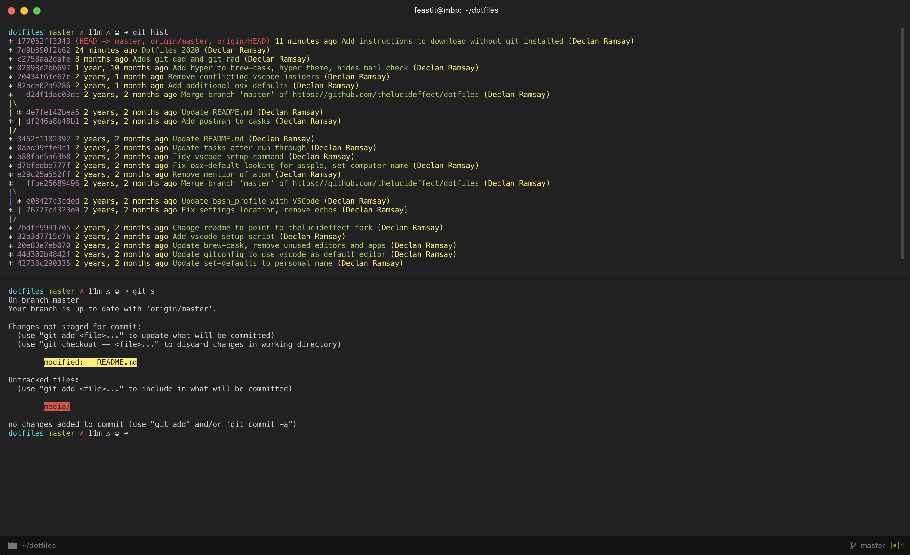

# 

This is a collection of dotfiles and scripts I use for customizing OS X to my liking and setting up the software development tools I use on a day-to-day basis. They should be cloned to your home directory so that the path is `~/dotfiles/`.  The included setup script creates symlinks from your home directory to the files which are located in `~/dotfiles/`.



The setup script is smart enough to back up your existing dotfiles into a `~/dotfiles_old/` directory if you already have any dotfiles of the same name as the dotfile symlinks being created in your home directory.

There are two setup scripts - [setup.sh](setup.sh) and [setup-new-machine.sh](setup-new-machine.sh). Setup new machine is intended to be run once on a new machine and installs numerous applications, extensions, and while setup can be run multiple times it is dependent on the machine to already be setup. The final command of [setup-new-machine.sh](setup-new-machine.sh) is to call [setup.sh](setup.sh) so you don't need to run the scripts separately.

## Setup Features

- Critical tools like git, nvm, Python, Homebrew, yarn
- Generates a SSH Key
- Installs all my applications including VSCode with extensions and theme, Hyper for terminal, various version of Chrome + Firefox; Utility Applications like spectacle, vanilla, Alfred and essentially applications like Spotify and VLC
- zsh with Oh-My-Zsh
- Sensible OSX Defaults - including relacing default dock icons, hiding desktop files, setting the background
- Git and zsh aliases (especially recommend `git rad` and `git dad`)
- Back up any existing dotfiles in your home directory to `~/dotfiles_old/`
- Create symlinks to the dotfiles in `~/dotfiles/` in your home directory

## Installation

```sh
$ git clone https://github.com/declanramsay/dotfiles.git ~/dotfiles
$ cd ~/dotfiles
$ chmod +x setup.sh
$ ./setup.sh
```

## Install using curl (especially new machines)

```sh
$ curl https://github.com/declanramsay/dotfiles/archive/master.zip --output ~/dotfiles.zip
$ unzip dotfiles.zip -d .
$ mv ~/dotfiles-master ~/dotfiles
$ cd ~/dotfiles
$ chmod +x setup.sh
$ chmod +x setup-new-machine.sh
$ ./setup-new-machine.sh
```

## Customize

### Local Settings

The dotfiles can be easily extended to suit additional local
requirements by using the following files:

#### `~/.zsh.local`

If the `~/.zsh.local` file exists, it will be automatically sourced
after all the other [shell related files](shell), thus, allowing its
content to add to or overwrite the existing aliases, settings, PATH,
etc.

#### `~/.gitconfig.local`

If the `~/.gitconfig.local` file exists, it will be automatically
included after the configurations from [`~/.gitconfig`](git/gitconfig), thus, allowing
its content to overwrite or add to the existing `git` configurations.

**Note:** Use `~/.gitconfig.local` to store sensitive information such
as the `git` user credentials, e.g.:

```sh
[user]
  name = Declan Ramsay
  email = declan@example.com
```

## OS X Defaults

My favorite part of this repo is the [set-defaults](osx/set-defaults.sh) script for OS X.

## Resources

I actively watch the following repositories and add the best changes to this repository:

- [GitHub ❤ ~/](http://dotfiles.github.com/)
- [Mathias’s dotfiles](https://github.com/mathiasbynens/dotfiles)
- [Nicolas Gallagher’s dotfiles](https://github.com/necolas/dotfiles)
- [Cătălin’s dotfiles](https://github.com/alrra/dotfiles)
- [Paul's dotfiles](https://github.com/paulirish/dotfiles)
- [Jacob Gillespie’s dotfiles](https://github.com/jacobwg/dotfiles)

## License

The code is available under the [MIT license](LICENSE).
